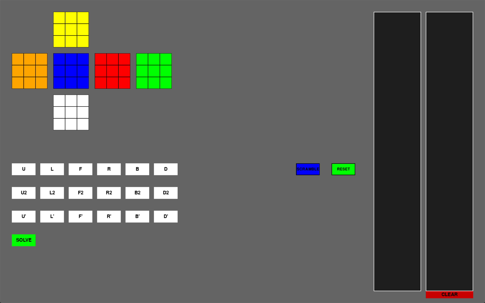
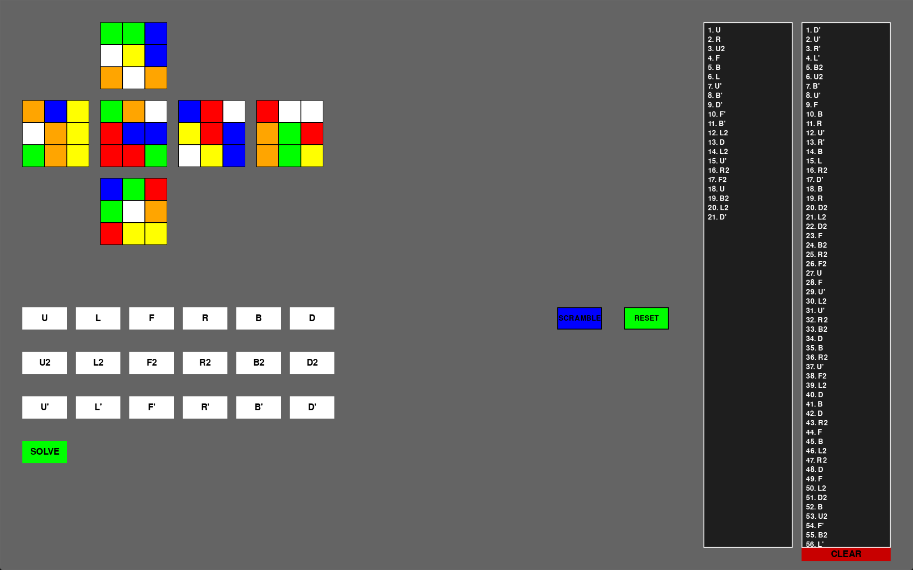

# Rubik's Cube Solver 🧩

A Python-based Rubik's Cube solver that uses the Kociemba two-phase alogirthm to find optimal or near-optimal solutions for any valid cube state.
Includes a visualizer built with Pygame and options for scrambling, manual input and visual feedback

This project models the cube using object-oriented programming and is built from scratch with clean modular code.  
This solver uses Kociemba's 2 phase algorithm to generate a solution for any scramble in about **20 moves!**


## 🚀 Features

- 🔍 Solves any valid Rubik’s Cube using the Kociemba algorithm

- 🧠 Fast and efficient 2-phase solving

- 😎 Fully interactive 2D Layout of a 3D Rubik's Cube and Real-time visual rotation with button clicks

- 🎨 Pygame-based cube visualizer with move history

- 🎲 Random scrambler built-in

- 🧪 Well-structured and modular codebase for future algorithm integrations (e.g., Layer-by-Layer)

- 🛠️ Clean OOP design with ```core/```, ```solver/```, and ```visualizer/``` modules


## 📸 Screenshots




---

## 📂 Project Structure

```plaintext
📦rubix-cube-solver/
├── core/
│   ├── __init__.py
│   ├── cube.py
│   ├── pieces.py
│   └── scramble.py
├── solver/
├── ├── __init__.py
│   └── kociemba.py
├── tests/
│   ├── test_cube.py
│   ├── test_pieces.py
│   ├── test_scramble.py
│   └── test_utils.py
├── uml/
│   └── rubix_cube.puml
├── utils/
│   ├── __init__.py
│   ├── colors.py
│   └── faces.py
├── visualizer/
│   ├── __init__.py
│   ├── button.py
│   └── UI.py
├── .coveragerc
├── .gitignore
├── LICENSE
├── main.py
├── Output1.png
├── Output2.png
├── pytest.ini
├── README.md
└── requirements.txt
```

---

## 🔧 Installation

### 1. Clone the Repository
```bash
git clone https://github.com/FuriousFire05/rubix-cube-solver.git
cd rubix-cube-solver
```

### 2. Install dependencies
```bash
pip install -r requirements.txt
```
Make sure you have Python 3.11+ installed.

---

## 🧪 Usage

Run the main GUI app:
```bash
python main.py
```

---

## 🧠 How It Works

This solver uses the Kociemba algorithm, which works in two phases:

- **Phase 1:** Reduces the cube to a specific subgroup
- **Phase 2:** Solves the cube from that subgroup in fewer moves

Learn more about the algorithm: [Kociemba’s site](https://kociemba.org/)


## 📦 Dependencies

- ```kociemba```
- ```pygame```
- ```enum34``` (if using Python < 3.4)

---

## 🛠️ Upcoming Features

- Ability to input custom cube states
- Color input via webcam
- Animate solution step-by-step
- Improve GUI design and responsiveness

## ✨ Notes

- Each face color follows the standard convention:
    - **U (Up)**    :   Yellow
    - **D (Down)**  :   White
    - **F (Front)** :   Blue
    - **B (Back)**  :   Green
    - **R (Right)** :   Red
    - **L (Left)**  :   Orange
- UML diagrams are created using **PlantUML** for visualizing the cube's structure and logic.
- UML diagrams are available in ```/uml/``` for internal logic representation

## 👤 Author

Created by [FuriousFire](https://github.com/FuriousFire05)

## License

This project is licensed under the MIT License - see the [LICENSE](LICENSE) file for details.
Copyright (c) 2025 [FuriousFire](https://github.com/FuriousFire05)