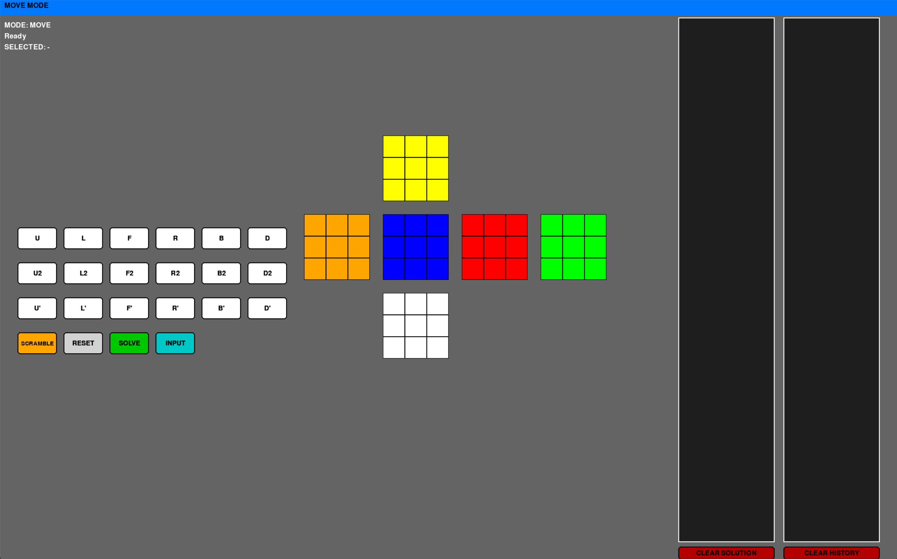
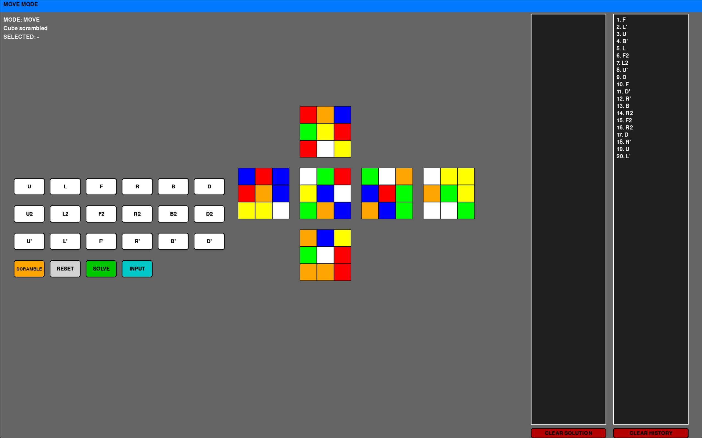
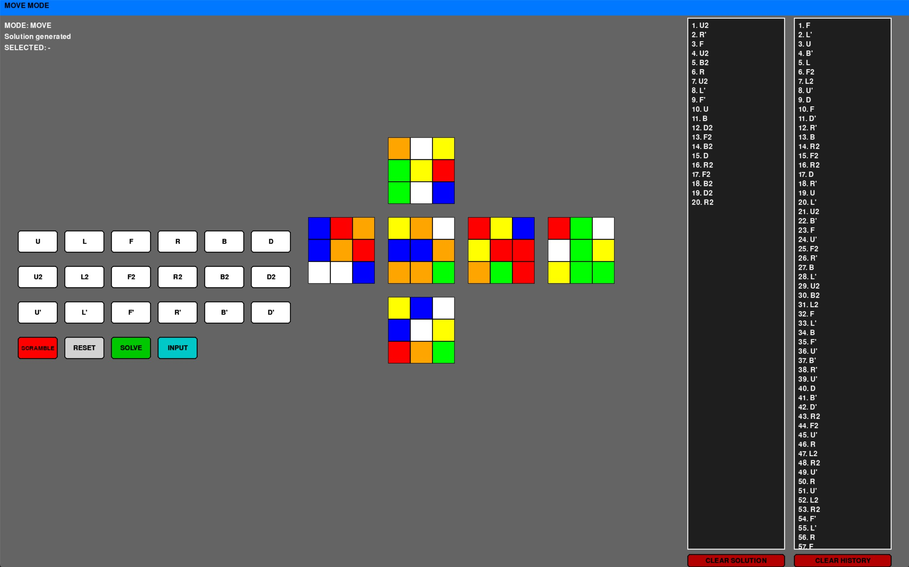
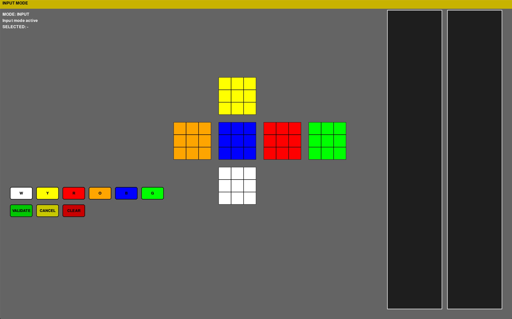
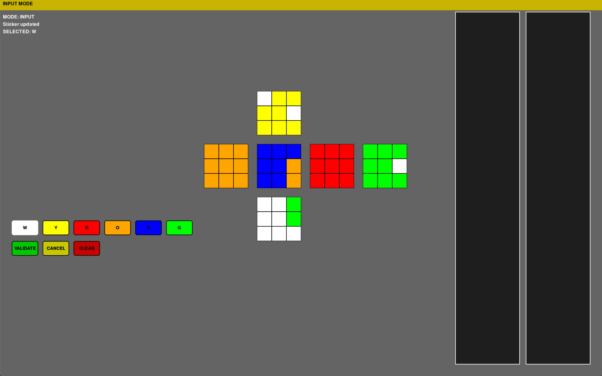
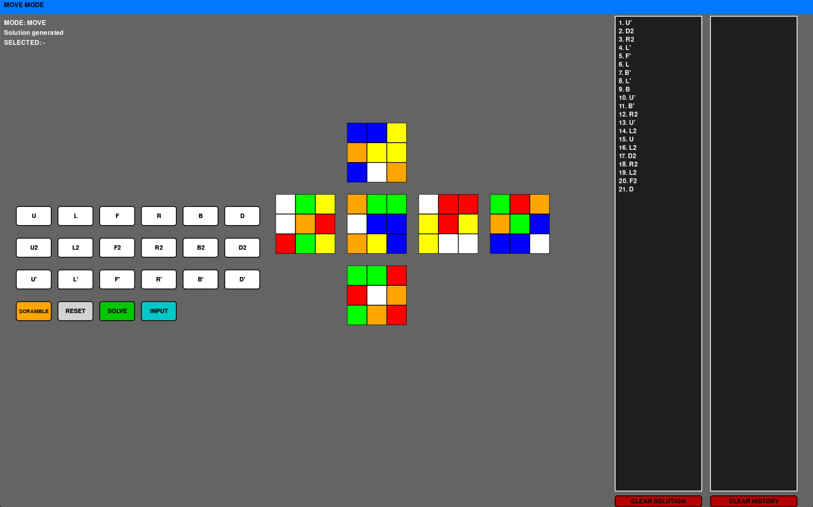
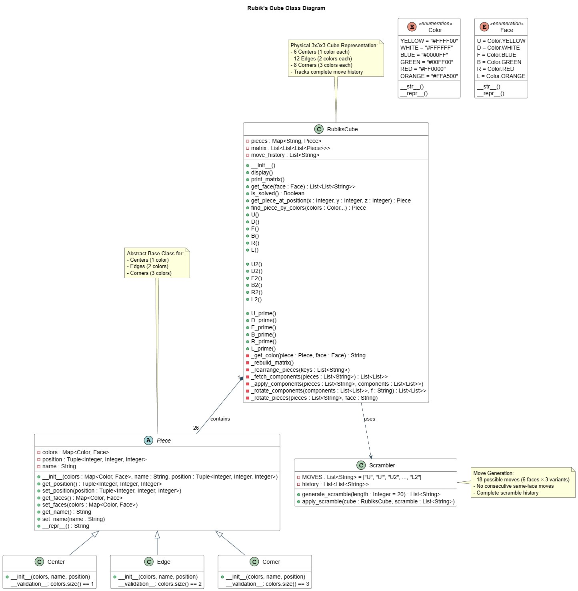

# ⚡ Rubix Pichu v1

## Rubik's Cube Solver & Simulator (Pichu Stage)
An interactive Rubik's Cube simulator built with **Python + Pygame**, featuring real-time cube manipulation, move history tracking, optimal solving with the **Kociemba algorithm**, and a **manual input mode** powered by a draft-cube workflow.

---

## 🚀 Features

- 🎮 Interactive 2D Rubik's Cube simulator
- 🔀 Random scramble generation
- 🧠 Optimal / near-optimal solving using the Kociemba algorithm
- ✍️ Manual cube input mode with editable **draft cube**
- ✅ Validation before committing manual edits
- 📜 Move history panel
- 📋 Solution panel
- 🖱️ Button-based controls for standard cube notation
- 🧪 Piece-based cube engine instead of a simple sticker array

---

## 🧠 Project Architecture

This project is built around a **piece-based Rubik's Cube engine**.

Instead of storing the cube as six flat faces only, the simulator models:
- **Centers**
- **Edges**
- **Corners**
- piece positions in 3D space
- face projections for rendering the unfolded 2D cube net

### Live Cube vs Draft Cube

The UI uses a **dual-cube workflow**:

- **Live Cube** → the trusted cube used in move mode
- **Draft Cube** → a temporary editable clone used in input mode

### Input Mode Workflow

1. Enter **Input Mode**
2. A **draft cube** is created from the live cube
3. Sticker edits are applied to the **draft cube**, not the live cube
4. The edited draft cube is validated
5. If valid, the draft cube replaces the live cube
6. If invalid, changes are rejected or can be cancelled

This keeps the main cube state safe while still allowing manual editing.

---

## 📁 Project Structure

```text
rubix-cube-solver/
├── core/
│   ├── __init__.py
│   ├── cube.py
│   ├── moves.py
│   ├── pieces.py
│   └── scramble.py
├── solver/
│   ├── __init__.py
│   └── kociemba.py
├── utils/
│   ├── __init__.py
│   ├── colors.py
│   └── faces.py
├── visualizer/
│   ├── __init__.py
│   ├── UI.py
│   ├── buttons.py
│   └── ui_state.py
├── screenshots/
│   ├── editing.jpg
│   ├── input_mode.jpg
│   ├── scramble.jpg
│   ├── solution.jpg
│   ├── ui_default.jpg
│   └── validation.jpg
├── uml/
│   ├── plantuml.jar
│   ├── rubix_cube.png
│   └── rubix_cube.puml
├── LICENSE
├── main.py
├── main.spec
└── requirements.txt
```

---

## ⚙️ Tech Stack

- **Python**
- **Pygame**
- **Kociemba**
- **PyInstaller** (for executable packaging)

---

## ▶️ How to Run

### 1. Install dependencies

```bash
pip install -r requirements.txt
```

### 2. Run the app

```bash
python main.py
```

---

## 🎮 Controls

### Move Mode

- `U, D, L, R, F, B`
- `U2, D2, L2, R2, F2, B2`
- `U', D', L', R', F', B'`
- `SCRAMBLE`
- `RESET`
- `SOLVE`
- `INPUT`

### Input Mode

- Select a color button (`W, Y, R, O, B, G`)
- Click stickers on the cube to edit the **draft cube**
- `VALIDATE` to confirm and apply
- `CANCEL` to discard
- `CLEAR` to reset the draft edits

---

## 🖼️ Screenshots

### Default UI


### Scrambled Cube


### Solver Output


### Input Mode


### Editing Stickers


### Validation Flow


---


## 📐 UML

A UML diagram for the project is included in the `uml/` folder.

- `rubix_cube.puml` → PlantUML source
- `rubix_cube.jpg` → rendered diagram

---

## 🧱 System Design



---

## 🚀 Future Scope

This project is intended as **V1 / Pichu** of a larger Rubik's Cube toolchain.

Planned future evolution includes:
- 3D cube visualization
- computer vision cube input
- guided learning / teaching mode
- richer UI and animations

---

## ✨ Notes

- Each face color follows the standard convention:
    - **U (Up)**    :   Yellow
    - **D (Down)**  :   White
    - **F (Front)** :   Blue
    - **B (Back)**  :   Green
    - **R (Right)** :   Red
    - **L (Left)**  :   Orange

Built as a deep-dive project in:
- simulation systems
- algorithmic problem solving
- UI-driven state management
- software architecture for interactive tools

## 👨‍💻 Author

Created by [FuriousFire](https://github.com/FuriousFire05)

## License

This project is licensed under the MIT License - see the [LICENSE](LICENSE) file for details.
Copyright (c) 2025 [FuriousFire](https://github.com/FuriousFire05)
